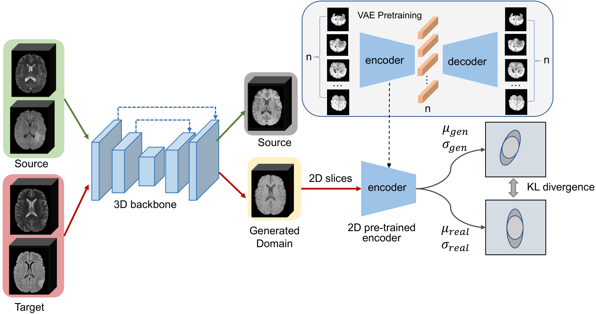
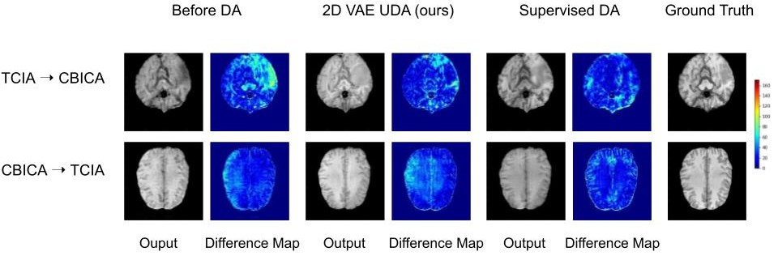

# 2D_VAE_UDA_for_3D_sythesis
This is the offical repository of our paper *Domain-adaptive 3D Medical Image Synthesis:
An Efficient Unsupervised Approach* .

## Abstract
Medical image synthesis has attracted increasing attention
because it could generate missing image data, improving diagnosis and
benefits many downstream tasks. However, so far the developed synthesis
model is not adaptive to unseen data distribution that presents domain
shift, limiting its applicability in clinical routine. This work focuses on ex-
ploring domain adaptation (DA) of 3D image-to-image synthesis models.
First, we highlight the technical difference in DA between classification,
segmentation and synthesis models. Second, we present a novel efficient
adaptation approach based on 2D variational autoencoder which approx-
imates 3D distributions. Third, we present empirical studies on effects of
the amount of data for adaptation and the key hyper-parameters. Our
results show that the proposed approach can significantly improve the
synthesis accuracy on unseen domains in a 3D setting.
## UDA Framework 
<center>
    
    <br>
    <div style="color:orange; border-bottom: 1px solid #d9d9d9;
    display: inline-block;
    color: #999;
    padding: 2px;">The main framework of our proposed 3D-UDA method for cross-modality MR image synthesis. In the source domain (green), the 3D backbone is trained supervisedly with aligned image data, translating FLAIR and T2 to T1. A spatial 2D variational autoencoder is first trained in the source domain using T1 modality. The dimension of its latent space is $n$. Then, in the adaptation stage, we compute the KL-divergence between the prior distribution of the generated volume and the target 3D distribution learned by a 2D variational autoencoder.</div>
</center>


## Domenstration
<center>
    
    <br>
    <div style="color:orange; border-bottom: 1px solid #d9d9d9;
    display: inline-block;
    color: #999;
    padding: 2px;">The synthesized image comparison between before DA, 2D VAE UDA (ours) and supervised DA methods is shown on CBICA -> TCIA and TCIA -> CBICA. The difference map is computed by subtracting the ground truth slice and the synthesized slice.</div>
</center>


## Set up the environment
To create a new virtual environment on your linux operating system, please use the following command:
```bash
conda env create -f environment.yml
```

## Prepare dataset
To train the network in the supervised manner, please make sure that your data is similiar to our structure:
```
domain1_train
├── BraTS19_CBICA_AAB_1
│   ├── BraTS19_CBICA_AAB_1_flair.nii.gz
│   ├── BraTS19_CBICA_AAB_1_seg.nii.gz
│   ├── BraTS19_CBICA_AAB_1_t1ce.nii.gz
│   ├── BraTS19_CBICA_AAB_1_t1.nii.gz
│   └── BraTS19_CBICA_AAB_1_t2.nii.gz
├── BraTS19_CBICA_AAG_1
│   ├── BraTS19_CBICA_AAG_1_flair.nii.gz
│   ├── BraTS19_CBICA_AAG_1_seg.nii.gz
│   ├── BraTS19_CBICA_AAG_1_t1ce.nii.gz
│   ├── BraTS19_CBICA_AAG_1_t1.nii.gz
│   └── BraTS19_CBICA_AAG_1_t2.nii.gz
├── BraTS19_CBICA_AAL_1
│   ├── BraTS19_CBICA_AAL_1_flair.nii.gz
│   ├── BraTS19_CBICA_AAL_1_seg.nii.gz
│   ├── BraTS19_CBICA_AAL_1_t1ce.nii.gz
│   ├── BraTS19_CBICA_AAL_1_t1.nii.gz
│   └── BraTS19_CBICA_AAL_1_t2.nii.gz
......
```
In order to train the network with 2D VAE in unsupervised manner, please manually split the target domain into validation set and testing set. 
```
domain2_val
├── BraTS19_TCIA01_131_1
├── BraTS19_TCIA01_147_1
├── BraTS19_TCIA01_150_1
├── BraTS19_TCIA01_180_1
├── BraTS19_TCIA01_186_1
......
```

```
domain2_test
├── BraTS19_TCIA05_396_1
├── BraTS19_TCIA05_444_1
├── BraTS19_TCIA05_456_1
├── BraTS19_TCIA05_478_1
......
```

After processing data, **your_dataset_path** should look like this:
```
your_dataset_path
├── domain1_test
├── domain1_train
├── domain1_val
├── domain2_test
├── domain2_train
├── domain2_val

```
## Train the 3D image-to-image network on source domain
First,
```
cd 3D-MRI/
```
Then
```bash
python train.py \
     --dataroot your_dataset_path \
     --name t2_flair_2_t1_pix2pix_sit_192_CBICA_supervised \
     --model pix2pix --direction AtoB --dataset_mode brain_3D \
     --dataset_name domain1 \
     --n_epochs 50 --n_epochs_decay 70 \
     --lr 0.0001 --input_nc 2 --output_nc 1 \
     --paired --netG sit --netD n_layers --n_layers_D 1 \
     --batch_size 1 --gpu_ids 0 \
```
**Note**: in order to run the above command, your gpu memory size has to be at least 24 GB. If you want to save your memory size, you can add "--amp" flag to the above command. By doing so, 12 GB memory would be enough.

## Train the 2D VAE
To train the 2D VAE for the unsupervised domain adaptation (UDA) process, please make sure that 3D volumes are cropped into 2D slices.

### Prepare 2D slices
First,
```
cd slice-to-3d-brain-vae
```
Then, modify the "input_folder" in preproc_hcp/process_our_data.py to your **3D-volume path**; modify the "precess_folder" in the same file to your **2D-slice path**. 

After the modification, please run:
```
python preproc_hcp/process_our_data.py
```
### Train the 2D VAE
To train the 2D VAE, please run:

```
python experiments/main_experiment_256.py --batch-size 256 --save_epoch_interval 10 --mri_data_dir your_2D_slice_path  --learning-rate 0.0001 --kl-latent-loss-weight 0.01
```

After the training is complete, you can get a 2D VAE's weight.

## Train UDA network on target domain 
If your source domain is "CBICA", and your target domain is "TCIA" as we described in our paper, the training command can be:
```
 python fine_tune.py \
     --dataroot your_dataset_path \
     --name t2_flair_2_t1_pix2pix_sit_192_CBICA2TCIA_uda_amp_5_55 \
     --model pix2pix --direction AtoB --dataset_mode brain_3D_transfer \
     --dataset_name_1 domain1_train --dataset_name_2 domain2_val \
     --n_epochs 5 --n_epochs_decay 0 \
     --lr 0.000001 --input_nc 2 --output_nc 1 \
     --paired --netG sit  --batch_size 1 --gpu_ids 0 \
     --netVae_path your_2D_VAE_weight_path
     --amp --pretrained_name t2_flair_2_t1_pix2pix_sit_192_CBICA --continue_train --ele_percent 55
```
**NOTE**: even with "--amp" flag, you still needs at least 20 GB gpu memory for this UDA training process.

## Test
After your UDA training is complete, you can run the following command to test the performance of your 3D image-to-image model:

```
python test.py \
    --dataroot ../datasets/BraTS_3D_MICCAI/ \
    --name t2_flair_2_t1_pix2pix_sit_192_CBICA2TCIA_uda_amp_5_55 \
    --model pix2pix --direction AtoB \
    --dataset_mode brain_3D --dataset_name domain2 \
    --input_nc 2 --output_nc 1 --paired --netG sit \
    --batch_size 1 --gpu_ids 0 --num_test 139 --phase test
```
## Citation

If you find our work is useful in your own research, please cite our work. 

## Acknowledgement
The image-to-image training code is from    [3D-MRI-style-transfer](https://github.com/Linus4world/3D-MRI-style-transfer).

The 2D VAE training code is build upon [slices-to-3d-brain-vae](https://github.com/voanna/slices-to-3d-brain-vae).


